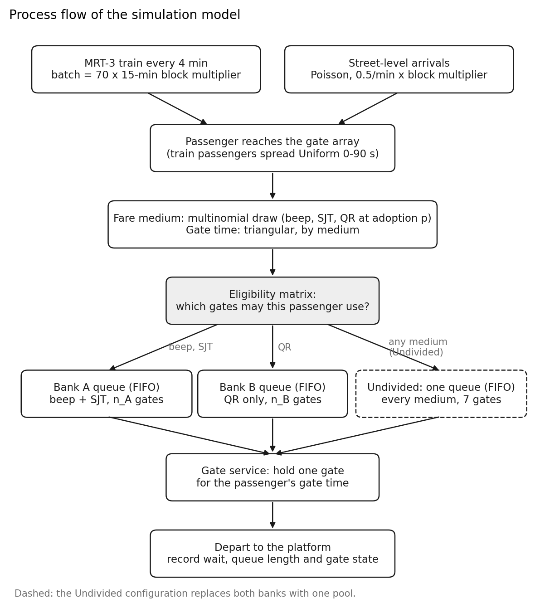

# Model specification

Conceptual model of the LRT-1 EDSA Side A entry gates (proposal Methodology
step 3). The code is the reference: every value below is set in `Params` in
`src/model.py`.

## Process flow

## Entities and attributes

| Entity | Attribute | Value or distribution | Set |
|---|---|---|---|
| Train (event) | arrival time | every 4 min from 16:00 | before the run |
| Train (event) | batch size | 70 × normalised 15-min block multiplier, rounded | before the run |
| Passenger | arrival time at the gates | train time + Uniform(0, 90 s); or street-level Poisson, 0.5/min × multiplier | before the run |
| Passenger | fare medium | multinomial: beep (80/97)(1−p), SJT (17/97)(1−p), QR p | before the run |
| Passenger | gate time | triangular (s): beep (2.0, 2.5, 3.5), SJT (2.5, 3.5, 5.0), QR (3.5, 5.0, 8.0) | before the run |
| Passenger | bank | from the eligibility matrix | on arrival |
| Passenger | wait, finish time | recorded | during the run |
| Bank (SimPy resource) | gates | n_A, n_B, or 7 when Undivided | per configuration |
| Bank (SimPy resource) | queue length, busy gates | logged at every change of state | during the run |

## Eligibility matrix

| Fare medium | Bank A (n_A gates) | Bank B (n_B gates) | Undivided (7 gates) |
|---|---|---|---|
| beep card | yes | no | yes |
| SJT | yes | no | yes |
| beep QR | no | yes | yes |

Under any divided split the matrix is block-diagonal: the fare medium alone
decides the bank. 7/0 is infeasible while anyone holds a QR ticket.

## Assumption register

| Parameter | Value | Basis (proposal register) | Range tested |
|---|---|---|---|
| Entry gates | 7 | direct observation, Sept 2026 | fixed |
| Surge window / warm-up | 16:00–20:00 / first 30 min | DOTr peak-block data | fixed |
| Mean arrival rate | 18 per min | 52,000 daily × 50% entries × 60% northbound × 28% peak block | 14–22 (app: 10–30) |
| MRT-3 headway | 4 min | published peak frequency 3–5 min | 3–5 min |
| Batch size per train | 70 | mean rate × headway, minus background | 50–100 |
| Footbridge dispersal | 90 s | about 150 m at mixed walking speeds | 60–120 s |
| Background arrivals | 0.5 per min | street-level, non-transfer | 0–2 per min |
| Within-window profile | 16 block multipliers, peak 1.43 after normalising | peaking factor 1.4 | fixed |
| beep / SJT / QR shares | 80% / 17% / 3% | LRTA fare media; QR introduced 2023 | QR 3–30% (swept); beep 70–85% |
| beep gate time | triangular (2.0, 2.5, 3.5) s | NFC tap, AFC literature | ±20% |
| SJT gate time | triangular (2.5, 3.5, 5.0) s | tap by less frequent users | ±20% |
| QR gate time | triangular (3.5, 5.0, 8.0) s | optical scan needing alignment | ±25% |

Out of scope, as in the proposal: exit, security inspection, ticket buying,
platform crowding, train capacity, balking and reneging, gate failures and
passenger errors, and the walk between banks (a fixed offset that shifts
arrivals but not the queues).
